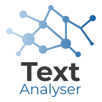

<a></a>

# TextAnalyser
Natural Language Processing (NLP) components for analysing and extracting information from text.

## Installation

```
conda create -n textanalyser python=3.6
conda activate textanalyser
python setup.py install
```

## Supported NLP components
- [Topic Modeling](./TextAnalyser/TopicModeling.py) (NMF, LDA and LSI)
- [Spam Classifier](./TextAnalyser/SpamClassifier.py)
- [Sentiment Classifier](./TextAnalyser/SentimentClassifier.py)

## Tutorials
Tutorials can be found in [examples](./examples)

## How to train
#### ✉️ Spam Classifier

```
spam_classifier = SpamClassifier()
pipeline = spam_classifier.train(X_train, y_train)
spam_classifier.evaluate(pipeline, X_test, y_test)
spam_classifier.save_pipeline(pipeline,
                              model_path='./models/model.pkl')
```
#### 📰 Topic Modeling
```
nmf_model = TopicModeling()
nmf_model.train_model(train_docs, model_type='nmf')
nmf_model.save_model(model_name='../models/nmf_model.pkl',
                     vectorizer_name='../models/nmf_vectorizer.pkl')
```
## 💫 Updates:
- 30/06/2019: Added Sentiment Classifier
- 30/06/2019: Added Email Spam Classifier
- 29/06/2019: Added Topic Modeling (NMF, LDA and LSI)
